# DPModel  

《[设计模式之禅](http://book.douban.com/subject/4260618/)》原书源码，有部分修改。存于此便于以后参考使用。

## 六大设计原则(SOLID)
 * [单一职责原则(SRP)](https://github.com/nivance/DPModel/tree/master/src/dp/com/company/srp)
 * [开闭原则(OCP)](https://github.com/nivance/DPModel/tree/master/src/dp/com/company/ocp)
 * [里氏替换原则(LSP)](https://github.com/nivance/DPModel/tree/master/src/dp/com/company/lsp)
 * [迪米特法则(LOD)](https://github.com/nivance/DPModel/tree/master/src/dp/com/company/lod)
 * [接口隔离原则(ISP)](https://github.com/nivance/DPModel/tree/master/src/dp/com/company/isp)
 * [依赖倒置原则(DIP)](https://github.com/nivance/DPModel/tree/master/src/dp/com/company/dip)  

## 23个设计模式  

### 1.[单例模式](https://github.com/nivance/DPModel/tree/master/src/dp/com/company/singleton)  
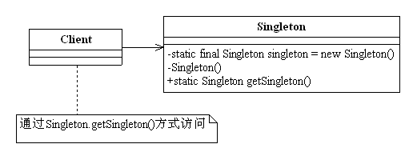

### 2.[工厂模式](https://github.com/nivance/DPModel/tree/master/src/dp/com/company/factorys)  
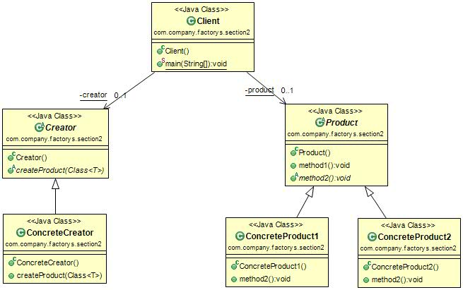

### 3.[抽象工厂模式](https://github.com/nivance/DPModel/tree/master/src/dp/com/company/factorya)   
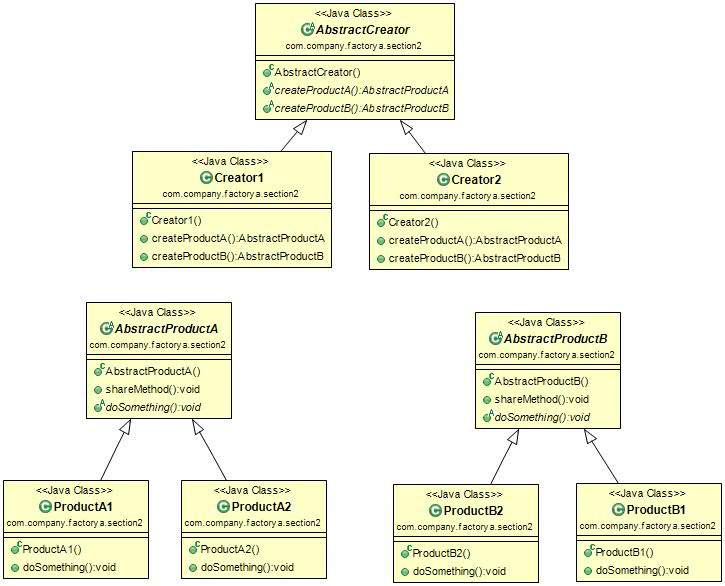

### 4.[模板模式](https://github.com/nivance/DPModel/tree/master/src/dp/com/company/template_method)  
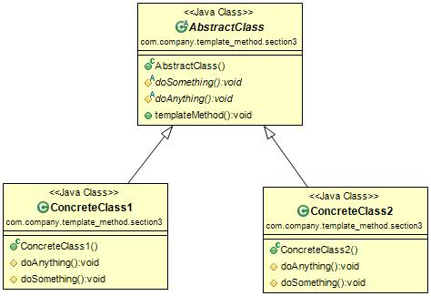

### 5.[建造者模式](https://github.com/nivance/DPModel/tree/master/src/dp/com/company/builder)  
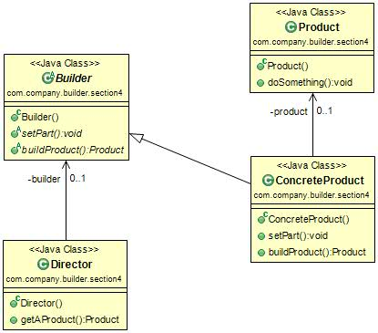

### 6.[代理模式](https://github.com/nivance/DPModel/tree/master/src/dp/com/company/proxy)  
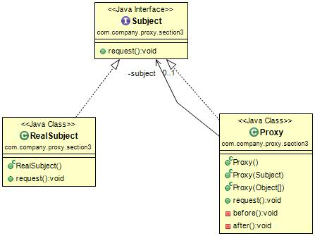

### 7.[原型模式](https://github.com/nivance/DPModel/tree/master/src/dp/com/company/prototype)  
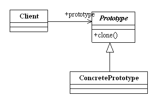

### 8.[中介模式](https://github.com/nivance/DPModel/tree/master/src/dp/com/company/mediator)  
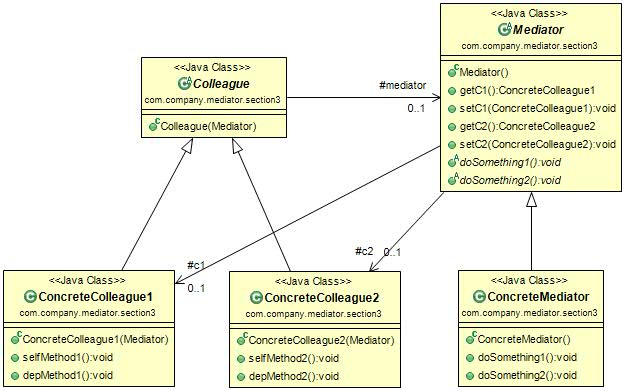

### 9.[命令模式](https://github.com/nivance/DPModel/tree/master/src/dp/com/company/command)  
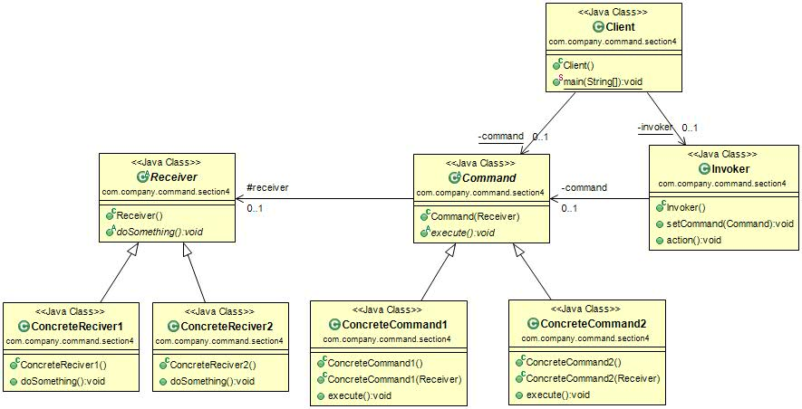

### 10.[责任链模式](https://github.com/nivance/DPModel/tree/master/src/dp/com/company/chain_of_responsibility)  
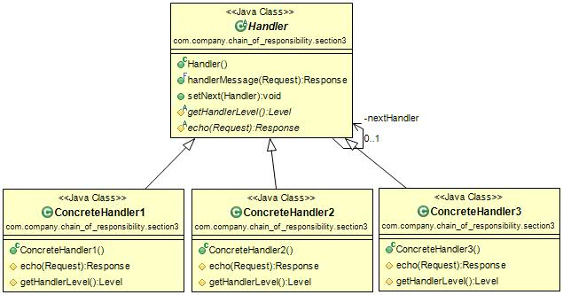

### 11.[装饰模式](https://github.com/nivance/DPModel/tree/master/src/dp/com/company/decorator)  
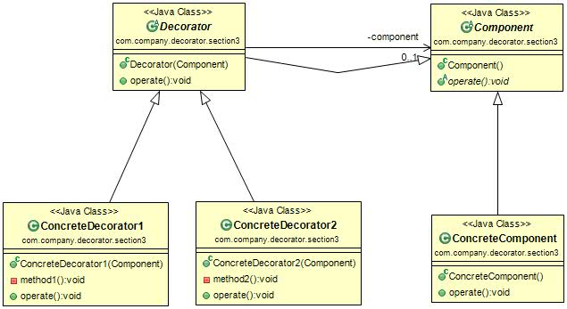

### 12.[策略模式](https://github.com/nivance/DPModel/tree/master/src/dp/com/company/strategy)  
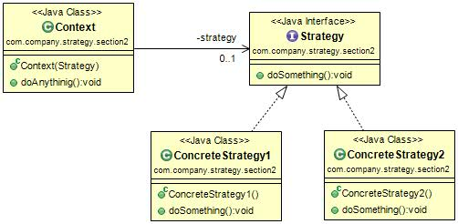

### 13.[适配器模式](https://github.com/nivance/DPModel/tree/master/src/dp/com/company/adapter)  
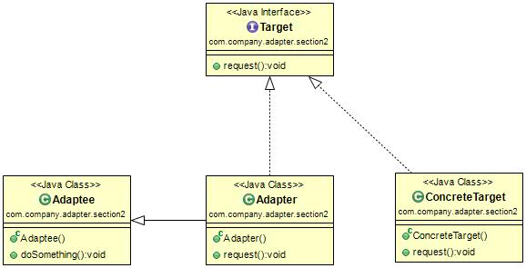

### 14.[迭代器模式](https://github.com/nivance/DPModel/tree/master/src/dp/com/company/iterator)  
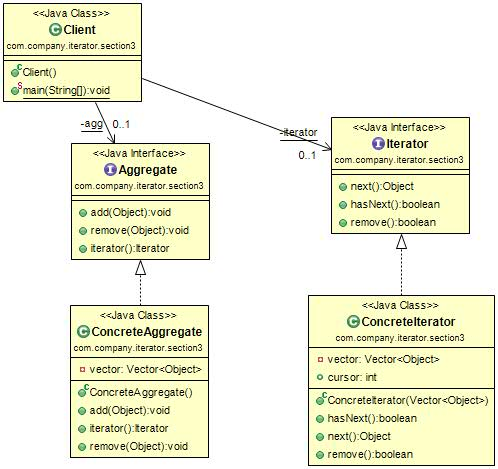

### 15.[组合模式](https://github.com/nivance/DPModel/tree/master/src/dp/com/company/composite)  
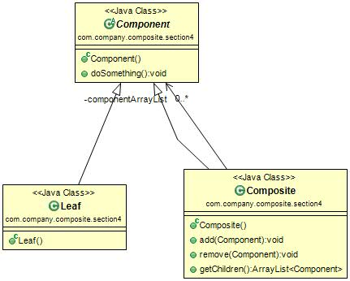

### 16.[观察者模式](https://github.com/nivance/DPModel/tree/master/src/dp/com/company/observer)  
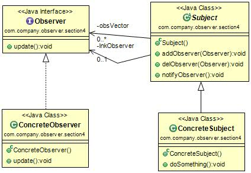

### 17.[门面模式](https://github.com/nivance/DPModel/tree/master/src/dp/com/company/facade)  
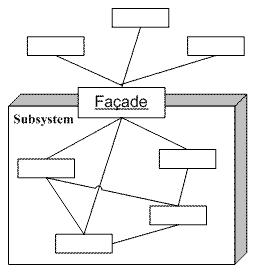

### 18.[备忘录模式](https://github.com/nivance/DPModel/tree/master/src/dp/com/company/memento)  
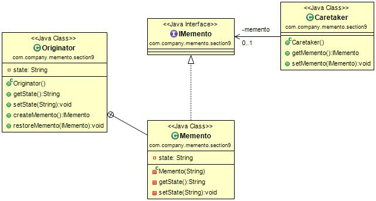

### 19.[访问者模式](https://github.com/nivance/DPModel/tree/master/src/dp/com/company/visitor)  
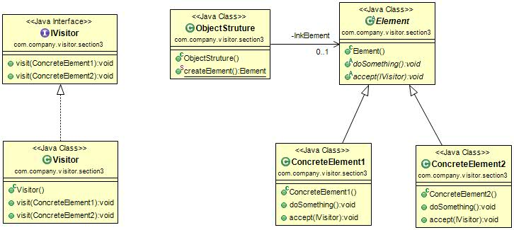

### 20.[状态模式](https://github.com/nivance/DPModel/tree/master/src/dp/com/company/state)  
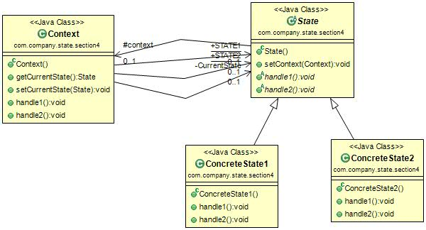

### 21.[解释器模式](https://github.com/nivance/DPModel/tree/master/src/dp/com/company/interpreter)  
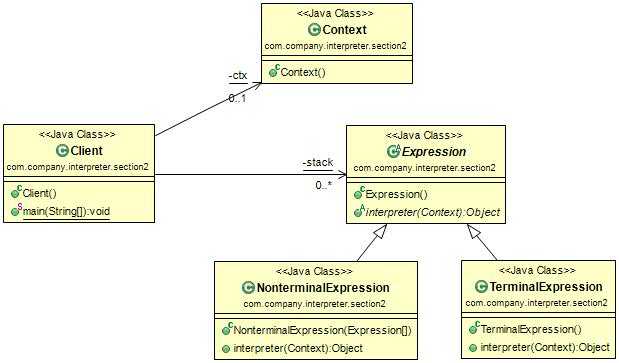

### 22.[享元模式](https://github.com/nivance/DPModel/tree/master/src/dp/com/company/flyweight)  
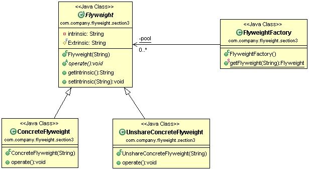

### 23.[桥接模式](https://github.com/nivance/DPModel/tree/master/src/dp/com/company/bridge)  
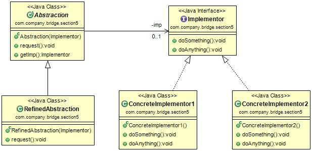

### 24.[MVC](https://github.com/nivance/DPModel/tree/master/src/dp/com/company/mvc)
